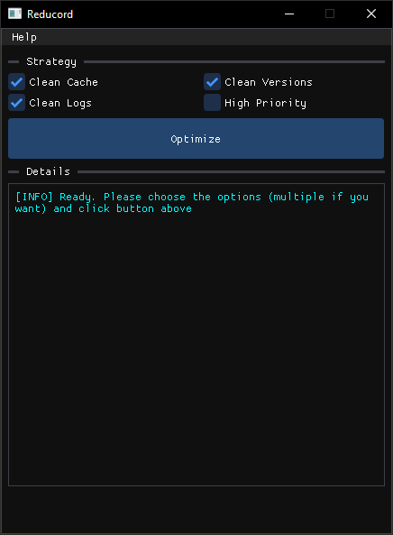

<p align="center">
  
  <br>
  <b>A lightweight, high-performance cleanup utility for Discord power users</b>
  <br>
  <i>Built with C++, Dear ImGui, and DirectX 11.</i>
</p>

<p align="center">
  
  
  
</p>


## 🚀 Key Features

* **🧹 Deep Cache Cleaning:** Safely wipe GPU cache, IndexDB, and temporary files that slow down the app.
* **🧼 logs Log Eraser:** Clear out bloated log files that eat up your disk space.
* **📦 Version Manager:** Identify and remove old Discord versions left behind after updates.
* **🔒 Safety First:** Built-in protection prevents cleaning while Discord is running to avoid data corruption.

## 📸 Screenshots

<p align="center">
  
</p>


## 🛠️ Tech Stack

- **Language:** C++17
- **GUI:** [Dear ImGui](https://github.com/ocornut/imgui)
- **Graphics:** DirectX 11
- **Architectural Pattern:** Clean Architecture (Core/UI decoupling)
- **Dependency Management:** [vcpkg](https://github.com/microsoft/vcpkg)


## 🏗️ Building from Source

### Prerequisites
* **Visual Studio 2026** (with C++ Desktop Development workload)
* **CMake** (3.15+)
* **vcpkg** (standard for MSVC)

### Instructions
1. **Clone the repo:**
   ```bash
   git clone https://github.com/shablin/reducord.git
   cd reducord
